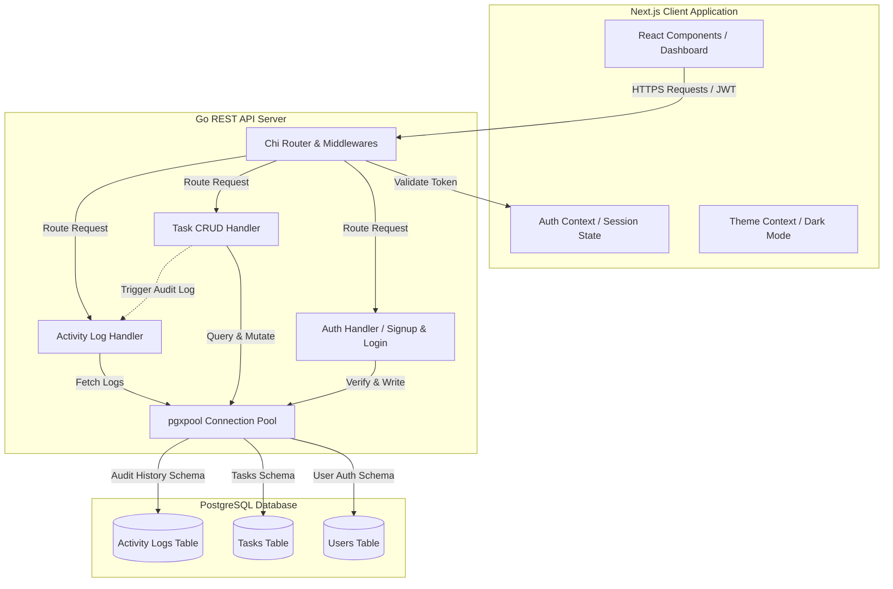

# AetherTasks — Premium Full-Stack Task Manager

A high-performance, full-stack Task Management application featuring a Go REST API backend, a Next.js App Router client application, and a PostgreSQL database.

---

## Architecture Design

Below is the conceptual architecture of AetherTasks, showing the client-side Next.js hooks, Go API routing filters, connection pooling, and the PostgreSQL relational schema:



---

## Technical Stack & Code Structure

- **Backend**: Go (using `go-chi/chi/v5` router, `pgx/v5` PostgreSQL connection pooling, `golang-jwt/jwt/v5` for authentication, and `golang.org/x/crypto/bcrypt` for secure password hashing).
- **Frontend**: Next.js (TypeScript, Tailwind CSS v4, Lucide React).
- **Database**: PostgreSQL (handling task persistence, user profiles, and audit trail tables).
- **Setup Orchestration**: Docker & Docker Compose.

### Directory Structure
```
├── backend/
│   ├── main.go         # API entrypoint, router, and middleware wiring
│   ├── db.go           # Connection pool & automatic database migrations
│   ├── auth.go         # Sign-up, login, password hashing, and JWT middleware
│   ├── tasks.go        # Tasks CRUD handlers, pagination, filters, and access controls
│   ├── logs.go         # Task activity audit log repository and handlers
│   ├── auth_test.go    # Unit tests for JWT, hashing, and email checks
│   └── Dockerfile      # Secure Go multi-stage build container
├── frontend/
│   ├── src/
│   │   ├── app/        # Next.js App Router (dashboard page, login/signup flows, layout)
│   │   ├── components/ # Premium UI components (TaskCard, TaskDialog, ThemeToggle)
│   │   └── context/    # Context providers for Auth state and Theme toggle
│   └── Dockerfile      # Frontend Node runner container
├── docker-compose.yml  # Orchestrates PostgreSQL, backend, and frontend
├── .env.example        # Environment variable templates
└── README.md           # Project documentation and API instructions
```

---

## Features Implemented

### 1. Robust Backend REST API
- Complete CRUD operations on `/tasks`.
- Parameterized safe raw SQL queries to defend against SQL injections.
- Consistent JSON error payloads and appropriate HTTP status codes.

### 2. User Authentication & Session Persistence
- Secure registration and login using JWT session validation.
- User passwords are securely salted and hashed using `bcrypt` before database storage.
- Auto-token recovery on page refresh from `localStorage`.
- Protected routes (unauthorized users are redirected to the Login page).

### 3. Filters, Title Search, & Custom Sorting
- Multi-dimensional filtering by status (`pending`, `in_progress`, `completed`).
- Case-insensitive search on task titles (`ILIKE %search%`).
- Advanced sorting by creation date, due date, and priority. Priority strings are dynamically mapped (`low -> 1`, `medium -> 2`, `high -> 3`) using custom SQL `CASE` constructs to sort logically.
- Unified filters, search, sorting, and cursor pagination all running together.

### 4. Admin Role & Access Control (RBAC)
- Normal users can only see, create, edit, or delete their own tasks.
- Administrators (`admin` role) can view, edit, search, and delete tasks belonging to any user in the system. The frontend dashboard lists the creator's email on each task card when logged in as an admin.

### 5. Detailed Activity Logs (Audit Trail)
- Every creation and update triggers an audit log action (e.g. `created`, `updated`).
- Modifications record a descriptive JSON-based diff detailing previous and new values (e.g., changes to title, priority, status, or due date).
- Users and admins can view a chronological log of changes on each task card.

### 6. Optimistic UI Updates
- Status complete toggles and task deletions execute immediately on the client dashboard interface, rolling back automatically if the backend API returns a network or permission error.

### 7. Persistent Dark Mode
- Smooth ThemeToggle switching between light and dark visual aesthetics, saved in `localStorage` and reflecting the user's OS preference as a default fallback.

---

## Quick Start (Docker Compose)

The easiest way to boot the full-stack system is using Docker Compose, which configures PostgreSQL, runs the backend migrations, compiles Go, builds Next.js, and starts all services in a shared network.

1. Verify Docker and Docker Compose are installed.
2. Clone the repository and navigate to the directory.
3. Boot the environment:
   ```bash
   docker compose up --build
   ```
4. Access the applications:
   - **Frontend Dashboard**: [http://localhost:3000](http://localhost:3000)
   - **Backend REST API**: [http://localhost:8080](http://localhost:8080)
   - **Database Port**: `5432`

---

## Manual Local Setup

If you prefer running the components directly on your system:

### 1. PostgreSQL Database
Ensure you have a PostgreSQL server running locally, create a database named `taskmanager`, and note your connection credentials.

### 2. Go Backend
1. Copy the environment template:
   ```bash
   cp .env.example backend/.env
   ```
2. Adjust the database variables in `backend/.env` (e.g., set `DATABASE_URL` to point to your local database).
3. Run migrations and start the Go server:
   ```bash
   cd backend
   go run .
   ```
   *The server will start on port `8080` and run the migrations automatically.*

### 3. Next.js Frontend
1. Copy the environment variables:
   ```bash
   cp .env.example frontend/.env.local
   ```
2. Navigate to the frontend directory, install dependencies, and start the development server:
   ```bash
   cd frontend
   npm install
   npm run dev
   ```
3. Access the dashboard at [http://localhost:3000](http://localhost:3000).

---

## Running Automated Tests

To execute Go unit tests (password hashing, JWT verification, and validation regex checks):
```bash
cd backend
go test -v ./...
```

---

## Assumptions & Trade-offs

1. **Local File Attachments**: For simplicity, file attachments are not implemented using external S3 services. If required, standard attachments can be handled via multipart form-data and stored in a shared volume or object storage.
2. **Auto-Migrations**: Instead of setting up complex external migration packages like `golang-migrate`, migrations run automatically at server startup by executing raw table schemas. This ensures zero-dependency setup for examiners.
3. **Optimistic Rollback Errors**: In production, we assume network calls succeed 99% of the time. If they fail (e.g., database timeout or authentication expiration), the interface alerts the user and smoothly rolls back to the previous list state, ensuring visual consistency.
4. **Token Storage**: JWT tokens are persisted in `localStorage` for convenience in this assessment code. In high-security banking/financial production apps, we recommend using secure HttpOnly cookies to protect against Cross-Site Scripting (XSS) threats.

---

## API Endpoints List

### Public Authorization Routes
- `POST /signup` — Register a new account.
  - Body: `{"email": "user@mail.com", "password": "securepassword", "role": "user"}` (role can be `user` or `admin`).
- `POST /login` — Sign in and retrieve JWT.
  - Body: `{"email": "user@mail.com", "password": "securepassword"}`.
  - Returns: `{"token": "JWT_STRING", "user": {...}}`.

### Protected Task Routes (Requires `Authorization: Bearer <token>`)
- `GET /tasks` — List tasks with filters, search, and pagination.
  - Query parameters:
    - `status` (`pending`, `in_progress`, `completed`).
    - `search` (searches text in title).
    - `sort_by` (`created_at`, `due_date`, `priority`).
    - `order` (`asc`, `desc`).
    - `page` (integer, default 1).
    - `limit` (integer, default 10).
- `POST /tasks` — Create a new task.
  - Body: `{"title": "My Task", "description": "Details...", "status": "pending", "priority": "medium", "due_date": "2026-06-11T12:00:00Z"}`.
- `GET /tasks/:id` — Fetch a single task by ID.
- `PATCH /tasks/:id` — Update fields dynamically.
  - Body: `{"title": "New Title", "status": "in_progress"}` (supports optional attributes).
- `DELETE /tasks/:id` — Delete a task.
- `GET /tasks/:id/logs` — Fetch chronological activity audit logs for a task.
